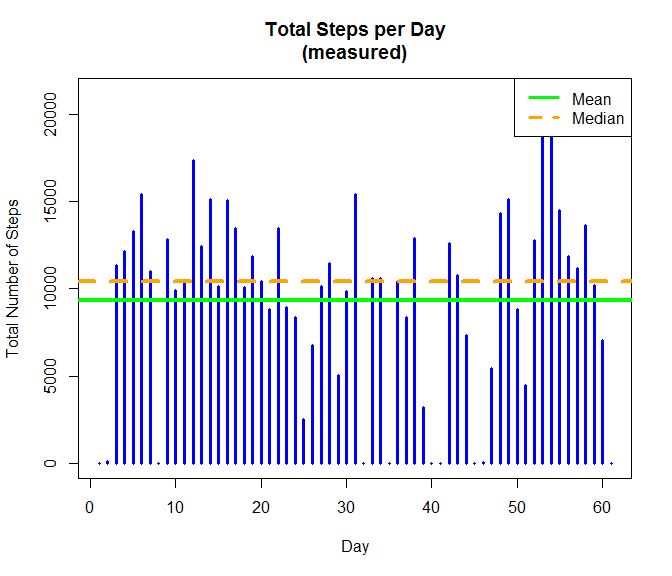
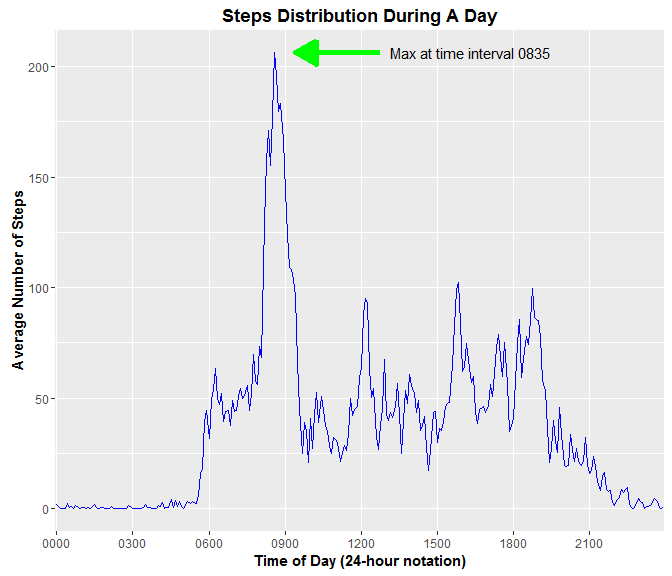
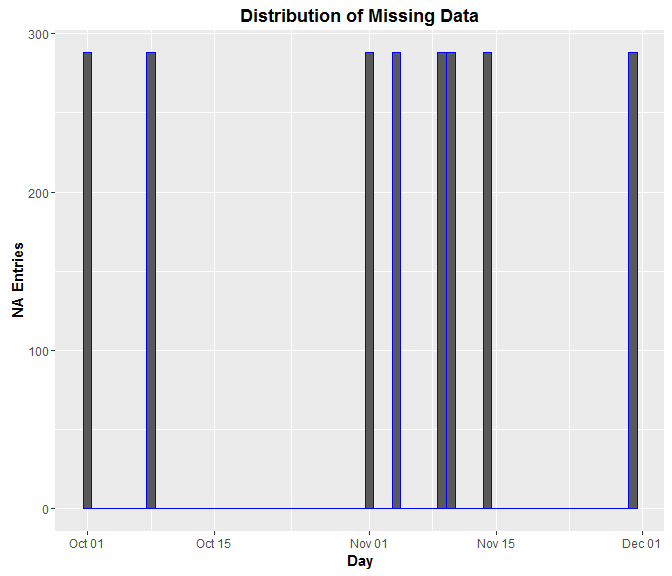
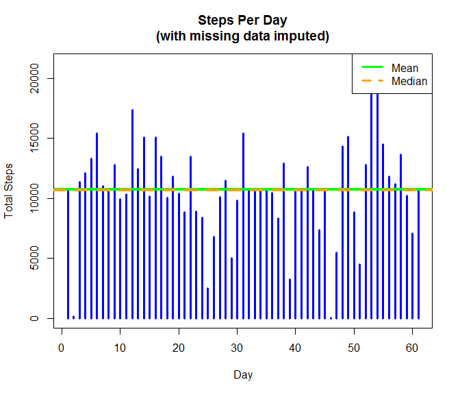
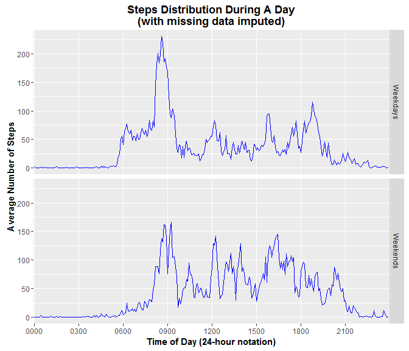

# Reproducible Research: Peer Assessment 1
Jeff Spoelstra  
`r Sys.Date()`  


## The Assignment

This assignment makes use of data from a personal activity monitoring device. This device collects data at 5 minute intervals through out the day. The data consists of two months of data from an anonymous individual collected during the months of October and November, 2012 and includes the number of steps taken in 5 minute intervals each day.

_(Source: course assignment README)_

## Data

The raw dataset is stored in a comma-separated-value (CSV) file named `activity.csv` located in the working directory with the analysis script.

The variables included in this dataset are:

* **steps:** Number of steps taking in a 5-minute interval (missing values are coded as NA)
* **date:** The date on which the measurement was taken in YYYY-MM-DD format
* **interval:** Identifier for the 5-minute interval in which measurement was taken

There are a total of 17,568 observations in this dataset. 

_(Source: course assignment README)_

## Loading and preprocessing the data

The raw dataset is loaded as follows.

```r
rdata <- read.csv(file="activity.csv", na.strings="NA", 
                  colClasses=c("integer", "Date", "integer"))
```
Note that the `steps` and `interval` variables are coerced to integer values, and `date` is coerced to `Date` class.

Verification of the data size and structure:

```r
str(rdata)
```

```
## 'data.frame':	17568 obs. of  3 variables:
##  $ steps   : int  NA NA NA NA NA NA NA NA NA NA ...
##  $ date    : Date, format: "2012-10-01" "2012-10-01" ...
##  $ interval: int  0 5 10 15 20 25 30 35 40 45 ...
```

```r
head(rdata)
```

```
##   steps       date interval
## 1    NA 2012-10-01        0
## 2    NA 2012-10-01        5
## 3    NA 2012-10-01       10
## 4    NA 2012-10-01       15
## 5    NA 2012-10-01       20
## 6    NA 2012-10-01       25
```

Obviously, there are NAs in the data. The statement `sum(is.na(rdata$steps))` is used to determine that there are **2304** NA values just in the `steps` data. The statement `sum(rowSums(is.na(rdata)))` is used to determine that there are **2304** total in the raw dataset. Since the values are the same, the analysis can move forward assuming all NA values are confined to the `steps` column.

## What is the mean total number of steps taken per day?

To determine the mean and median number of steps per day, the raw data is grouped and summarized by `date`. A `totsteps` column is added and calculated as the sum of the `steps` variable overall all time intervals for each day. The mean and median number of steps are calculated from `totsteps` over all days of observations. For use later in the analysis, a `numna` column is added and calculated to be the number of NA observations for each day.


```r
ddata <- rdata %>% group_by(date) %>% 
         summarise(totsteps=sum(steps, na.rm=TRUE), numna=sum(is.na(steps)))

avgsteps<-mean(ddata$totsteps)
mediansteps<-median(ddata$totsteps)
```

The calculated mean total number of steps per day is **9354.23** and the median is 
**10395**. At this point in the analysis, NA values in the dataset are ignored. They will be dealt with in a later step.

The information is plotted as follows.


```r
plot(x=ddata$totsteps, type="h", lwd=3, col="blue",
     main="Total Steps per Day\n(measured)",
     xlab="Day", ylab="Total Number of Steps")

abline(h=avgsteps, lwd=4, col="green")
abline(h=mediansteps, lwd=4, lty="dashed", col="orange")

legend("topright", col = c("green", "orange"), lwd=3, lty=c("solid", "dashed"),
       legend = c("Mean", "Median"))
```



## What is the average daily activity pattern?

To determine the average daily activity pattern (i.e., the average number of steps taken during each time interval overall all days), the raw data is grouped and summarized by `interval`. A `avgsteps` column is added and calculated as the mean of the `steps` variable over all days of observations. Another column is added as a four-digit character version of the `interval` column. On data plots, this will be used to show time intervals in HHMM form.


```r
idata <- rdata %>% group_by(interval) %>% summarise(avgsteps=mean(steps, na.rm=TRUE)) %>%
         mutate(sinterval=sprintf("%04d", interval)) %>% arrange(sinterval)
```

After computing the time interval averages, the analysis determines what time interval has the largest average number of steps.


```r
maxidx <- which.max(idata$avgsteps)
maxavg <- as.numeric(idata[maxidx, "avgsteps"])
maxinterval <- as.character(idata[maxidx, "sinterval"])
```

The highest average is **206.17** and occurs at time interval **0835**.

The information is plotted as follows.


```r
xticks <- c("0000", "0300", "0600", "0900", "1200",
            "1500", "1800", "2100")

x1 <- as.character(idata[maxidx+10, "sinterval"])  # annotation placement
x2 <- as.character(idata[maxidx+50, "sinterval"])  # annotation placement
xt <- as.character(idata[maxidx+55, "sinterval"])  # annotation placement
y1 <- y2 <- yt <- maxavg                             # annotation placement

a <- ggplot(data=idata, aes(x=sinterval, y=avgsteps, group=1)) + 
     geom_line(color="blue", na.rm=TRUE) + 
     scale_x_discrete(breaks=xticks) + 
     theme(plot.title=element_text(face="bold"), axis.title=element_text(face="bold")) +
     xlab("Time of Day (24-hour notation)") + 
     ylab("Average Number of Steps") + 
     ggtitle("Steps Distribution During A Day") +
     annotate(geom="segment", x=x1, xend=x2, y=y1, yend=y2, color="green", size=2,
              arrow=arrow(ends="first", type="closed")) +
     annotate(geom="text", x=xt, y=yt, hjust=0,
              label=paste("Max at time interval", maxinterval))
a
```



## Imputing missing values

The first step in dealing with NA values in the data is to see how they are distributed throughout the data. Note that this plot uses the `numna` column computed earlier.


```r
a <- ggplot(data=ddata, aes(x=date, y=numna, group=1)) + 
     geom_bar(stat="identity", color="blue") + 
     theme(plot.title=element_text(face="bold"), axis.title=element_text(face="bold")) +
     xlab("Day") + 
     ylab("NA Entries") + 
     ggtitle("Distribution of Missing Data")
a
```



It is clear from the chart that a total of eight days are affected, and that all of the data (for all time intervals) for those days is missing. For all of the other days, the data is complete.

Because this is a significant number of days missing (>10%) the analysis imputes values for the missing data. It does so by replacing the missing data with the corresponding data from the time interval averages (rounded to an integer value). For example, if time interval "0800" data is NA then it is replaced by the average data for time interval "0800". The code to do so is below. Note that rather than replacing the raw data, the changes are made to a copy of it.


```r
fdata <- rdata
for (x in 1:nrow(fdata)) {
    if (is.na(fdata[x,"steps"])) {
        intidx <- x %% 288
        if (intidx == 0) {
            fdata[x, "steps"] <- as.integer(idata[288, "avgsteps"])
        }
        else {
            fdata[x, "steps"] <- as.integer(idata[intidx, "avgsteps"])
            
        }
    }
}
```

This is a brute force algorithm and probably could be done more elegantly always assuming that all of the data for a day needs to be replaced. However, this method was used because it allows for partially missing data in future datasets.

The daily step totals and the mean and median for all days are recalculated (using the same algorithm as before) and reploted with the new complete data. 


```r
ddata2 <- fdata %>% group_by(date) %>% summarise(totsteps=sum(steps))

avgsteps2 <- mean(ddata2$totsteps)
mediansteps2 <- median(ddata2$totsteps)

plot(x=ddata2$totsteps, type="h", lwd=3, col="blue",
     main="Steps Per Day\n(with missing data imputed)",
     xlab="Day", ylab="Total Steps")

abline(h=avgsteps2, lwd=4, col="green")
abline(h=mediansteps2, lwd=4, lty="dashed", col="orange")

legend("topright", col = c("green", "orange"), lwd=3, lty=c("solid", "dashed"),
       legend = c("Mean", "Median"))
```



The new mean value is **10749.77** and the new median is **10641**.

It seems like there must be a processing error for the new mean and median to be so close. Upon closer analysis, the median value is explained by looking at a sorting of the data.


```r
sort(ddata2$totsteps)
```

```
##  [1]    41   126  2492  3219  4472  5018  5441  6778  7047  7336  8334
## [12]  8355  8821  8841  8918  9819  9900 10056 10119 10139 10183 10304
## [23] 10395 10439 10571 10600 10641 10641 10641 10641 10641 10641 10641
## [34] 10641 10765 11015 11162 11352 11458 11829 11834 12116 12426 12608
## [45] 12787 12811 12883 13294 13452 13460 13646 14339 14478 15084 15098
## [56] 15110 15414 15420 17382 20427 21194
```

From this list, it is easily seen that the imputed eight days show up as 10641 (the sum of the interval averages used to fill in those days) in the middle of the sorted data (where the median is determined).

With regard to the daily mean, adding eight days of data with total steps larger than the original mean value can only cause that value to increase; especially considering that the same eight days were treated as zero in the original mean calculation because the NAs were ignored.

The moral of the story is to be careful when filling in missing data. In this case, it may have been better to remove the missing days altogether from the data rather than blindly using the `na.rm=TRUE` option by default. 

## Are there differences in activity patterns between weekdays and weekends?

For this analysis, the `date` variable must first be used to identify weekday days and weekend days in the data. This is added as the `wkday` column in the data. Note that the completed (imputed) data is used for this analysis.


```r
wklist <- list(Saturday="Weekends", Sunday="Weekends", Monday="Weekdays", 
               Tuesday="Weekdays", Wednesday="Weekdays", Thursday="Weekdays", 
               Friday="Weekdays")
wdata <- mutate(fdata, wkday=as.character(wklist[weekdays(date)]))
```

Next, the time interval averages are again computed, but this time grouped by `wkday` first and then by `interval`.


```r
idata2 <- wdata %>% group_by(wkday, interval) %>% summarise(avgsteps=mean(steps)) %>%
          mutate(sinterval=sprintf("%04d", interval)) %>% arrange(sinterval)
```

The results are plotted together as a two-facet cart.


```r
# Multi-plot the average number of steps per time interval split by weekday vs weekend.
a <- ggplot(data=idata2, aes(x=sinterval, y=avgsteps, group=1)) + 
    facet_grid(wkday~.) +
    geom_line(color="blue") + 
    scale_x_discrete(breaks=xticks) + 
    theme(plot.title=element_text(face="bold"), axis.title=element_text(face="bold")) +
    xlab("Time of Day (24-hour notation)") + 
    ylab("Average Number of Steps") + 
    ggtitle("Steps Distribution During A Day\n(with missing data imputed)")
a
```



The Weekdays plot shows a pattern very similiar to the plot for all days created earlier. This is no surprise since there are so many more weekday days in the data than weekend days. There is clearly a lot of morning activity followed by smaller peaks around mid-day, mid-afternoon, and early evening.

The Weekends plot shows morning activity as well, and then peaks spread throughout the rest of the day.

It would appear that weekday walking activity is more structured, probably around work/school schedules while weekend walking is more freely structured.
